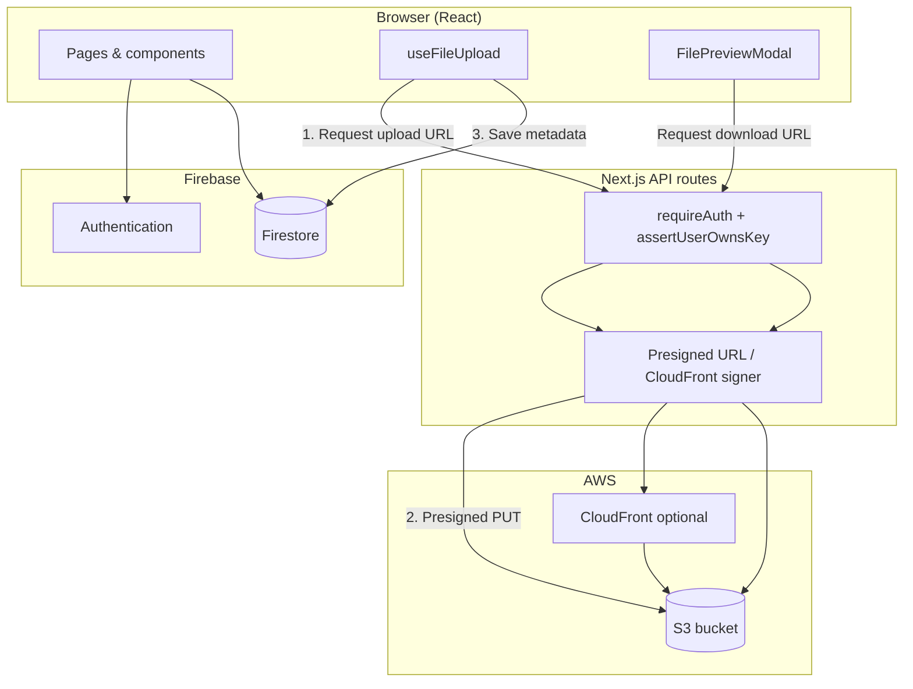

# Disk Drive — Cloud Storage App

A full-stack Google Drive–style cloud storage app built with **Next.js**, **Firebase**, and **AWS S3**. Users can upload, preview, organize, star, search, and trash files with a responsive UI for desktop and mobile.

**Live demo:** [google-drive-clone-roan.vercel.app](https://google-drive-clone-roan.vercel.app/)

---

## Features

### Files & storage
- Upload files via modal or **drag-and-drop** anywhere in the app
- **5 MB** per-file limit, **100 MB** total storage per user
- In-browser **file preview** (images, PDFs, video, audio)
- **Download** and **copy link** (signed URL)
- **Rename** files (list view: double-click or menu; grid view: ⋮ menu)
- **Star / unstar** files
- **Trash** with restore or permanent delete (removes S3 object)

### My Drive
- **Quick Access** — up to 6 files (starred first, then recently opened)
- **Grid / list toggle** (persisted in `localStorage`)
- List view: hover actions (download, copy, share, rename, delete)
- Grid view: ⋮ dropdown menu per card

### Navigation & search
- **My Drive**, **Recent**, **Starred**, **Trash** pages
- Inline **search** with dropdown results (no separate search page)
- **Mobile bottom nav** + floating upload button
- Collapsible sidebar on desktop

### Auth & UX
- **Google sign-in** via Firebase Auth
- Dark / light theme
- Storage usage indicator
- Toast notifications for actions
- Fixed header/sidebar; only main content scrolls

---

## Architecture

The app uses a **split storage model**: file bytes live in S3; metadata lives in Firestore. The Next.js server never stores files — it only issues short-lived signed URLs after verifying the user.



### What is stored where

| Layer | Stores | Examples |
|--------|--------|----------|
| **AWS S3** | File content (binary) | `files/{userId}/{uuid}-{filename}` |
| **Firestore `myfiles`** | Active file metadata | `userId`, `filename`, `s3Key`, `size`, `contentType`, `starred`, `timestamp`, `lastOpenedAt` |
| **Firestore `trash`** | Trashed file metadata | Same fields as `myfiles` (S3 object kept until permanent delete) |
| **Firebase Auth** | User identity | Google OAuth session |
| **Redux** | UI state | Sidebar open, user display name/photo |
| **localStorage** | Client preferences | Grid vs list view mode |

### Upload flow

1. Client checks file size and user quota (`uploadLimits.js`).
2. Client calls `POST /api/upload-url` with Firebase ID token.
3. Server validates auth, quota, and returns a **presigned S3 PUT URL** + `s3Key`.
4. Browser uploads the file **directly to S3** (with progress).
5. Client writes a document to Firestore `myfiles` with metadata and `s3Key`.

### Download / preview flow

1. Client calls `POST /api/download-url` (or `/api/download-file` for forced download) with `s3Key`.
2. Server verifies the user owns the key (`files/{userId}/...` prefix).
3. Server returns a **signed URL** (CloudFront if configured, otherwise S3 presigned GET, 15 min expiry).
4. Browser fetches or previews the file from that URL.

### Delete flow

- **Move to trash:** copy metadata to `trash`, delete `myfiles` doc (S3 object unchanged).
- **Restore:** copy back to `myfiles`, delete `trash` doc.
- **Permanent delete:** `POST /api/delete-file` removes S3 object, then delete `trash` doc.

---

## Tech stack

| Area | Technology |
|------|------------|
| Framework | Next.js 14 (App Router) |
| UI | React 18, styled-components, MUI icons |
| State | Redux Toolkit, React Context |
| Auth | Firebase Authentication (Google) |
| Database | Cloud Firestore (real-time `onSnapshot`) |
| Object storage | AWS S3 |
| CDN (optional) | CloudFront signed URLs |
| Animation | Framer Motion |
| Notifications | react-toastify |

---

## Project structure

```
src/
├── app/                    # Next.js routes & API
│   ├── (home)/             # Authenticated app shell
│   │   ├── home/           # My Drive
│   │   ├── recent/
│   │   ├── starred/
│   │   └── trash/
│   └── api/                # Server routes (S3 signing, auth)
├── components/
│   ├── common/             # FilesList, preview, drop zone, etc.
│   ├── header/             # Search, profile, logo
│   ├── home/               # My Drive layout, Quick Access grid
│   ├── mobile/             # Bottom navigation
│   └── sidebar/            # Nav + upload modal
├── context/                # Files, upload, preview providers
├── hooks/                  # useFileUpload, useUserFiles, useStorageInfo
├── lib/
│   ├── server/             # S3, Firebase Admin, auth helpers
│   ├── awsStorage.js       # Client upload to S3
│   ├── fileAccess.js       # Download / delete from client
│   ├── quickAccess.js      # Quick Access selection logic
│   └── uploadLimits.js     # Quota constants & checks
└── store/                  # Redux slices
```

---

## Getting started

### Prerequisites

- Node.js **22.x**
- Firebase project (Auth + Firestore)
- AWS account with an S3 bucket
- (Optional) CloudFront distribution with signed URLs

### Installation

```bash
git clone https://github.com/Mayankkatheriya/google-drive-clone.git
cd google-drive-clone
npm install
```

### Environment variables

Create a `.env.local` file in the project root:

```bash
# Firebase (client — exposed to browser)
NEXT_PUBLIC_APIKEY=
NEXT_PUBLIC_AUTHDOMAIN=
NEXT_PUBLIC_PROJECT_ID=
NEXT_PUBLIC_MESSAGING_SENDER_ID=
NEXT_PUBLIC_APP_ID=

# Firebase Admin (server — API route auth)
FIREBASE_PROJECT_ID=
FIREBASE_CLIENT_EMAIL=
FIREBASE_PRIVATE_KEY=

# AWS S3
AWS_REGION=
AWS_ACCESS_KEY_ID=
AWS_SECRET_ACCESS_KEY=
S3_BUCKET_NAME=

# CloudFront (optional — falls back to S3 presigned GET)
CLOUDFRONT_DOMAIN=
CLOUDFRONT_KEY_PAIR_ID=
CLOUDFRONT_PRIVATE_KEY=
```

Legacy `VITE_*` env names are still supported for Firebase client config via `next.config.mjs`.

### Run locally

```bash
npm run dev
```

Open [http://localhost:3000](http://localhost:3000).

### Build for production

```bash
npm run build
npm start
```

---

## API routes

| Route | Method | Purpose |
|-------|--------|---------|
| `/api/upload-url` | POST | Auth + quota check → presigned S3 upload URL |
| `/api/download-url` | POST | Auth + ownership → signed download/preview URL |
| `/api/download-file` | POST | Auth + ownership → proxied file download |
| `/api/delete-file` | POST | Auth + ownership → delete S3 object |

All routes require `Authorization: Bearer <Firebase ID token>`.

---

## Security notes

- S3 bucket should be **private** (no public read/list).
- File access is gated by Firebase auth and `assertUserOwnsKey` — users can only request URLs for keys under their own `files/{userId}/` prefix.
- Signed URLs expire after **15 minutes**.
- Files are encrypted **in transit** (HTTPS), not end-to-end encrypted — anyone with full S3 bucket or server AWS credentials can read stored objects.
- Configure **Firestore security rules** so users can only read/write their own documents (`userId == request.auth.uid`).

---

## Storage limits

| Limit | Value |
|-------|-------|
| Max file size | 5 MB |
| Max total per user | 100 MB (includes trash) |

Defined in `src/lib/uploadLimits.js`.

---

## Scripts

| Command | Description |
|---------|-------------|
| `npm run dev` | Start development server |
| `npm run build` | Production build |
| `npm start` | Run production server |
| `npm run lint` | ESLint |

---

## Contributing

Issues and pull requests are welcome.
