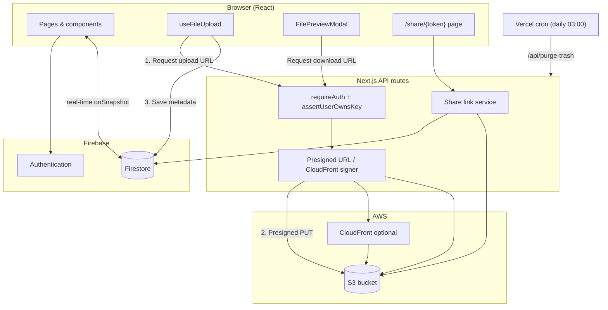

# Disk Drive — Cloud Storage App

A full-stack Google Drive–style cloud storage app built with **Next.js**, **Firebase**, and **AWS S3**. Users can upload, preview, organize into folders, version, share, search, and trash files with a responsive UI for desktop and mobile.

**Live demo:** [google-drive-clone-roan.vercel.app](https://google-drive-clone-roan.vercel.app/)

---

## Features

### Files & storage

- Upload files via modal or **drag-and-drop** anywhere in the app
- **Voice memos** — record audio in the browser and save it as a file
- **5 MB** per-file limit, **100 MB** total storage per user
- In-browser **file preview** (images, PDFs, video, audio) with arrow-key navigation
- **Download** single files, or multiple files/folders as a **ZIP**
- **Rename**, **star / unstar**, and **move** files between folders
- **Version history** — keeps up to 5 previous versions of a file; restore any of them
- **Self-destruct timer** — auto-move a file to Trash after 1h / 6h / 24h / 7d
- **Storage breakdown** + **cleanup assistant** (duplicates, large files, unused files, expired links, old trash)


### Folders & organization

- Create **nested folders** with breadcrumb navigation
- **Multi-select mode** for bulk actions
- **Compare mode** — view two images or two PDFs side by side
- **Focus mode** — hide the chrome and filter to PDFs, images, or starred files


### Sharing

- **Secure share links** with optional:
  - password protection
  - expiry time
  - view limit (including **one-time links**)
  - view-only mode (download disabled)
- Manage, revoke, and delete links per file
- **QR code** and social share buttons
- Public `/share/{token}` page with secure image, PDF, video, and audio viewers
- Link-preview bots (Slack, WhatsApp, etc.) don't consume a view


### Trash

- Move to Trash, restore, or permanently delete (removes the S3 object)
- Items in Trash are **auto-deleted after 15 days** (daily cron + on-visit cleanup)


### Navigation & search

- **My Drive**, **Recent**, **Starred**, **Trash** pages
- Inline **search** with dropdown results
- **Command palette** (`⌘K` / `Ctrl+K`)
- **Mobile bottom nav** + floating upload button
- Collapsible sidebar on desktop
- Guided **product tour** for first-time users


### Auth & UX

- **Google sign-in** via Firebase Auth
- Dark / light theme
- Grid / list view toggle (persisted in `localStorage`)
- Skeleton loaders, toast notifications, Lottie animations

---


## Architecture

The app uses a **split storage model**: file bytes live in S3; metadata lives in Firestore. The Next.js server never stores files — it verifies the user and issues short-lived signed URLs, so uploads and downloads go **directly between the browser and S3**.


```mermaid
flowchart TB
  subgraph Client["Browser (React)"]
    UI[Pages & components]
    Upload[useFileUpload]
    Preview[FilePreviewModal]
    SharePage["/share/{token} page"]
  end

  subgraph Firebase["Firebase"]
    Auth[Authentication]
    FS[(Firestore)]
  end

  subgraph Server["Next.js API routes"]
    AuthZ[requireAuth + assertUserOwnsKey]
    Sign[Presigned URL / CloudFront signer]
    Share[Share link service]
  end

  subgraph AWS["AWS"]
    S3[(S3 bucket)]
    CF[CloudFront optional]
  end

  Cron["Vercel cron (daily 03:00)"]

  UI --> Auth
  UI <-->|real-time onSnapshot| FS
  Upload -->|1. Request upload URL| AuthZ
  AuthZ --> Sign
  Sign -->|2. Presigned PUT| S3
  Upload -->|3. Save metadata| FS
  Preview -->|Request download URL| AuthZ
  Sign --> CF
  CF --> S3
  Sign --> S3
  SharePage --> Share
  Share --> FS
  Share --> S3
  Cron -->|/api/purge-trash| Server
```


### What is stored where


| Layer                                 | Stores                       | Examples                                                                                                                                            |
| ------------------------------------- | ---------------------------- | --------------------------------------------------------------------------------------------------------------------------------------------------- |
| **AWS S3**                            | File content (binary)        | `files/{userId}/{uuid}-{filename}`                                                                                                                  |
| **Firestore** `myfiles`               | Active files and folders     | `userId`, `filename`, `type`, `parentId`, `s3Key`, `size`, `contentType`, `starred`, `timestamp`, `lastOpenedAt`, `selfDestructAt`, `versionsBytes` |
| **Firestore** `myfiles/{id}/versions` | Previous versions of a file  | `s3Key`, `size`, `contentType`, `filename`, `createdAt`                                                                                             |
| **Firestore** `trash`                 | Trashed file metadata        | Same fields as `myfiles` + `trashedAt`                                                                                                              |
| **Firestore** `shareLinks`            | Share links (doc ID = token) | `userId`, `fileId`, `s3Key`, `passwordHash`, `expiresAt`, `maxViews`, `viewCount`, `allowDownload`                                                  |
| **Firebase Auth**                     | User identity                | Google OAuth session                                                                                                                                |
| **Redux**                             | Global UI state              | Sidebar open, user display name/photo                                                                                                               |
| **React Context**                     | Feature state                | Files, current folder, preview, selection, compare, focus, upload, tour                                                                             |
| **localStorage**                      | Client preferences           | Grid vs list view mode                                                                                                                              |


### Upload flow

1. Client checks file size and user quota (`uploadLimits.js`).
2. Client calls `POST /api/upload-url` with a Firebase ID token.
3. Server validates auth and quota, then returns a **presigned S3 PUT URL** + `s3Key`.
4. Browser uploads the file **directly to S3** (with progress).
5. Client writes a document to Firestore `myfiles` with metadata and `s3Key`.


### Download / preview flow

1. Client calls `POST /api/download-url` (or `/api/download-file` for a proxied download) with `s3Key`.
2. Server verifies the user owns the key (`files/{userId}/...` prefix).
3. Server returns a **signed URL** (CloudFront if configured, otherwise S3 presigned GET, 15 min expiry).
4. Browser fetches or previews the file from that URL.
5. Multi-file downloads are fetched one by one and zipped in the browser with JSZip.


### Version flow

- Replacing a file archives the current `s3Key` into the `versions` subcollection, then points the file doc at the new upload.
- At most **5** versions are kept; the oldest S3 object is deleted when the limit is exceeded.
- Version sizes count toward the 100 MB quota (`versionsBytes`).


### Share link flow

1. Owner calls `POST /api/share-link/create` → server generates a random 48-char token and stores the link in `shareLinks` (password hashed with scrypt).
2. Visitor opens `/share/{token}` → the page reads public metadata (name, type, whether a password is needed). `GET /api/share-link/{token}` returns the same metadata and never counts a view.
3. If password-protected, `POST /api/share-link/{token}/unlock` returns a 1-hour signed unlock token. After 5 wrong passwords the link is locked for 15 minutes.
4. `POST /api/share-link/{token}` redeems the link inside a **Firestore transaction** (checks revoked / expired / view limit and increments `viewCount`) and returns a 1-hour signed **access token**.
5. Content is served via a signed URL, or streamed through `GET /api/share-link/{token}/content?access=…` (supports HTTP range requests). The content route requires the access token and re-checks revoke and expiry.


### Delete flow

- **Move to trash:** copy metadata to `trash`, delete `myfiles` doc (S3 object unchanged).
- **Restore:** copy back to `myfiles`, delete `trash` doc.
- **Permanent delete:** `POST /api/delete-file` removes the S3 object, then the `trash` doc is deleted.
- **Auto-purge:** items trashed more than 15 days ago are removed by a daily Vercel cron (`GET /api/purge-trash`) and by a per-user check when the app loads (`POST /api/purge-trash`).
- **Self-destruct:** files past their `selfDestructAt` time are moved to Trash. This check runs in the browser every minute while the app is open.

---


## Tech stack


| Area           | Technology                               |
| -------------- | ---------------------------------------- |
| Framework      | Next.js 14 (App Router)                  |
| UI             | React 18, styled-components, MUI         |
| State          | Redux Toolkit, React Context             |
| Auth           | Firebase Authentication (Google)         |
| Database       | Cloud Firestore (real-time `onSnapshot`) |
| Server auth    | Firebase Admin SDK                       |
| Object storage | AWS S3                                   |
| CDN (optional) | CloudFront signed URLs                   |
| PDF rendering  | pdfjs-dist                               |
| ZIP downloads  | JSZip                                    |
| Sharing        | qrcode.react, react-share                |
| Product tour   | driver.js                                |
| Animation      | Framer Motion, Lottie, canvas-confetti   |
| Notifications  | react-toastify                           |
| Hosting        | Vercel (with cron jobs)                  |


---


## Project structure

```
src/
├── app/                    # Next.js routes & API
│   ├── (home)/             # Authenticated app shell
│   │   ├── home/           # My Drive
│   │   ├── recent/
│   │   ├── starred/
│   │   └── trash/
│   ├── share/[token]/      # Public share link page
│   └── api/                # Server routes (S3 signing, share links, trash purge)
├── components/
│   ├── common/             # FilesList, preview, compare, modals, drop zone, etc.
│   │   └── skeleton/       # Loading skeletons
│   ├── header/             # Search, profile, logo
│   ├── home/               # My Drive layout, Quick Access grid
│   ├── mobile/             # Bottom navigation
│   ├── share/              # Secure viewers for the share page
│   ├── sidebar/            # Nav, upload modal, voice memo
│   └── ...                 # login, recent, starred, trash
├── context/                # Auth, files, folder, preview, selection, compare, focus, upload, tour
├── hooks/                  # useFileUpload, useUserFiles, useStorageInfo, useVoiceMemo, purge hooks
├── lib/
│   ├── server/             # S3, CloudFront, Firebase Admin, share links, trash purge
│   ├── awsStorage.js       # Client upload to S3
│   ├── fileAccess.js       # Download / ZIP / delete from client
│   ├── fileVersions.js     # Version history
│   ├── folders.js          # Folder tree helpers
│   ├── selfDestruct.js     # Self-destruct timers
│   ├── cleanupAssistant.js # Storage cleanup suggestions
│   └── uploadLimits.js     # Quota constants & checks
└── store/                  # Redux slices
```

---


## Getting started


### Prerequisites

- Node.js **22.x**
- Firebase project (Auth + Firestore)
- AWS account with an S3 bucket
- (Optional) CloudFront distribution with signed URLs


### Installation

```bash
git clone https://github.com/Mayankkatheriya/google-drive-clone.git
cd google-drive-clone
npm install
```


### Environment variables

Create a `.env.local` file in the project root:

```bash
# Firebase (client — exposed to browser)
NEXT_PUBLIC_APIKEY=
NEXT_PUBLIC_AUTHDOMAIN=
NEXT_PUBLIC_PROJECT_ID=
NEXT_PUBLIC_MESSAGING_SENDER_ID=
NEXT_PUBLIC_APP_ID=

# Public app URL (used to build share links when no Origin header is present)
NEXT_PUBLIC_APP_URL=

# Firebase Admin (server — API route auth)
FIREBASE_PROJECT_ID=
FIREBASE_CLIENT_EMAIL=
FIREBASE_PRIVATE_KEY=

# AWS S3
AWS_REGION=
AWS_ACCESS_KEY_ID=
AWS_SECRET_ACCESS_KEY=
S3_BUCKET_NAME=

# CloudFront (optional — falls back to S3 presigned GET)
CLOUDFRONT_DOMAIN=
CLOUDFRONT_KEY_PAIR_ID=
CLOUDFRONT_PRIVATE_KEY=

# Share links — secret used to sign unlock/access tokens (set a long random value)
SHARE_LINK_UNLOCK_SECRET=

# Vercel cron — protects GET /api/purge-trash
CRON_SECRET=
```

Legacy `VITE_*` env names are still supported for Firebase client config via `next.config.mjs`.

### Run locally

```bash
npm run dev
```

Open [http://localhost:3000](http://localhost:3000).

### Build for production

```bash
npm run build
npm start
```

---


## API routes


| Route                             | Method | Auth         | Purpose                                           |
| --------------------------------- | ------ | ------------ | ------------------------------------------------- |
| `/api/upload-url`                 | POST   | User         | Auth + quota check → presigned S3 upload URL      |
| `/api/download-url`               | POST   | User         | Auth + ownership → signed download/preview URL    |
| `/api/download-file`              | POST   | User         | Auth + ownership → proxied file download          |
| `/api/delete-file`                | POST   | User         | Auth + ownership → delete S3 object               |
| `/api/purge-trash`                | POST   | User         | Delete the user's trash items older than 15 days  |
| `/api/purge-trash`                | GET    | Cron secret  | Delete all expired trash (Vercel cron)            |
| `/api/share-link/create`          | POST   | User         | Create a share link for an owned file             |
| `/api/share-link/list`            | GET    | User         | List the user's share links (optionally per file) |
| `/api/share-link/revoke`          | POST   | User         | Revoke a share link                               |
| `/api/share-link/delete`          | POST   | User         | Delete a share link                               |
| `/api/share-link/[token]`         | GET    | Public       | Public link metadata                              |
| `/api/share-link/[token]`         | POST   | Public       | Redeem the link (counts a view) → access token    |
| `/api/share-link/[token]/unlock`  | POST   | Public       | Verify password → unlock token (rate limited)     |
| `/api/share-link/[token]/content` | GET    | Access token | Stream file content (range requests supported)    |


"User" routes require `Authorization: Bearer <Firebase ID token>`. The cron route requires `Authorization: Bearer <CRON_SECRET>`.

---


## Security setup (required for production)

- Keep the S3 bucket **private** (no public read/list).
- Deploy `firestore.rules` (Firebase Console → Firestore → Rules, or `firebase deploy --only firestore:rules`).
- Set `SHARE_LINK_UNLOCK_SECRET` to a long random value (e.g. `openssl rand -hex 32`).
- Grant the server's IAM user `s3:ListBucket` on the bucket so the storage quota is checked against real S3 sizes.
- Files are encrypted in transit (HTTPS), not end-to-end — anyone with bucket or server AWS credentials can read them.

---


## Storage limits


| Limit                  | Value                                     |
| ---------------------- | ----------------------------------------- |
| Max file size          | 5 MB                                      |
| Max total per user     | 100 MB (includes trash and file versions) |
| Versions kept per file | 5                                         |
| Trash retention        | 15 days                                   |


Defined in `src/lib/uploadLimits.js`, `src/lib/fileVersions.js`, and `src/lib/trashRetention.js`.

---


## Scripts


| Command         | Description              |
| --------------- | ------------------------ |
| `npm run dev`   | Start development server |
| `npm run build` | Production build         |
| `npm start`     | Run production server    |
| `npm run lint`  | ESLint                   |


---


## Contributing

Issues and pull requests are welcome.